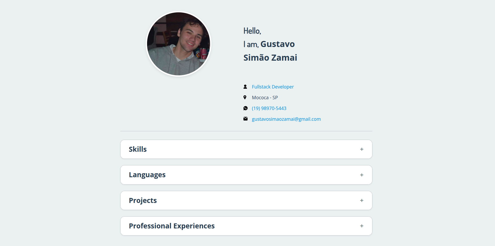
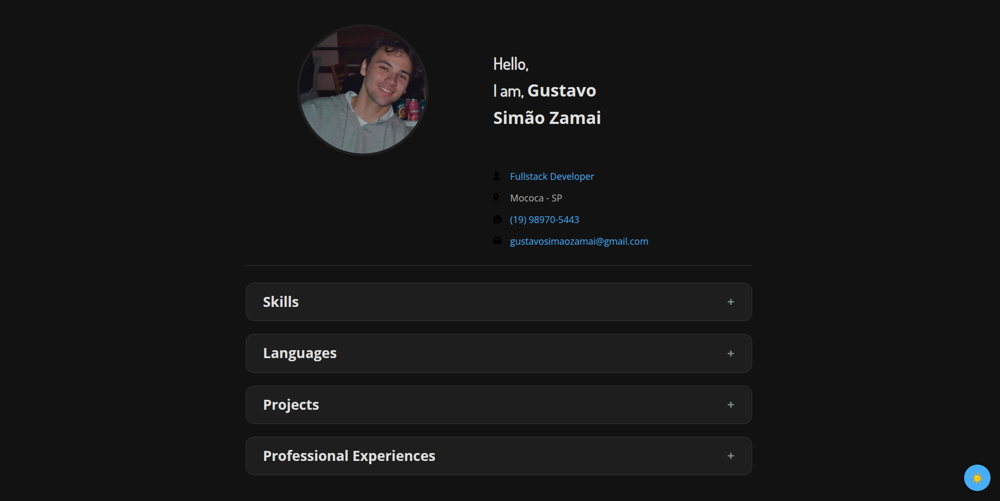

# 📄 Online Portfolio

A responsive online portfolio project to showcase professional skills, languages, work experience, and useful links like LinkedIn and GitHub.

<p align="center">
  
  
</p>

---

## ✨ Features

- Display of personal and professional information
- Highlight of technical skills and languages
- Responsive layout for multiple devices
- Integration with external links (GitHub, LinkedIn, etc.)
- Toggle theme between light and dark

---

## 🚀 Technologies Used

- HTML5
- CSS3
- JavaScript
- Git & GitHub
- Figma
- API Integration

---

## 📁 Project Structure

```yaml
portfolio-gustavo-zamai/
├── index.html          # Main HTML structure
├── assets/
│     ├── css/          # CSS files
│     ├── images/       # images and icons
│     ├── js/           # JS files
├── .github/
│ └── preview.png       # Project preview image
└── README.md           # Project documentation
```

---

## ▶️ How to Use

#### 1. Clone the repository:
```bash
git clone https://github.com/Gustavo-Zamai/portfolio-gustavo-zamai.git
cd portfolio-gustavo-zamai
```
#### 2. Open index.html in your browser:

```bash
start index.html      # On Windows
# or
open index.html       # On macOS
# or
xdg-open index.html   # On Linux
# No installation required — it's a fully static front-end game!
```

## 📚 What I Learned
- Writing semantic and structured HTML
- Creating responsive layouts using CSS
- Enhancing pages with basic JavaScript 
- Working with version control using Git
- Consume data froma JSON file
- Create dark mode function

## 📝 License

This project is licensed under the MIT License. Feel free to use and modify it as needed.

## 👤 Author
#### Gustavo Zamai

[LinkedIn](https://www.linkedin.com/in/gustavo-sim%C3%A3o-zamai-664a5521a/) • 
[GitHub](https://github.com/Gustavo-Zamai)

